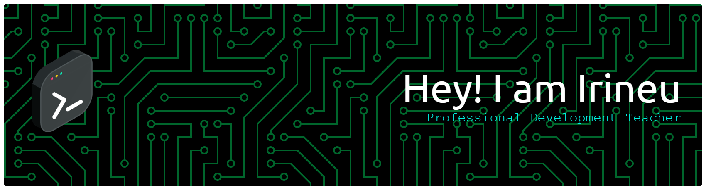

  

  Sou um professor, desenvolvedor e entusiasta de tecnologia apaixonado por criar soluções inovadoras que unem o mundo do software, hardware e design. Com uma base sólida em <strong>desenvolvimento</strong>, <strong>banco de dados</strong> e <strong>gestão de projetos</strong>, estou sempre explorando novas fronteiras em <strong>IoT</strong> e <strong>eletrônica</strong>.

---

### 🚀 Principais Habilidades e Ferramentas

  

---

### 🎬 Meus Interesses Além do Código

Além da tecnologia, sou um grande fã de cultura geek e adoro uma boa história. Se você quiser conversar sobre...

- **Fantasia e Ficção Científica:** *O Senhor dos Anéis* e *Star Wars*.
- **Heróis e Vilões:** As complexas narrativas da Marvel, DC e outros universos.
- **Paradoxos Temporais:** A genialidade por trás de séries como *Dark*.
- **Ciência e Humor:** A combinação perfeita de *The Big Bang Theory*.

... me chame para um papo!

---

### 📫 Vamos nos Conectar?

Estou sempre aberto a novas conexões, colaborações e discussões sobre tecnologia ou o último episódio da sua série favorita!

